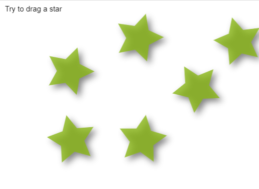

# React Konva
React Konva is a JavaScript library for drawing complex canvas graphics using [React](https://reactjs.org/)
# picture Demo

**How to listen to an event on a canvas shape with React and Konva?**

[Documentation](https://konvajs.org/docs/events/Cancel_Propagation.html)